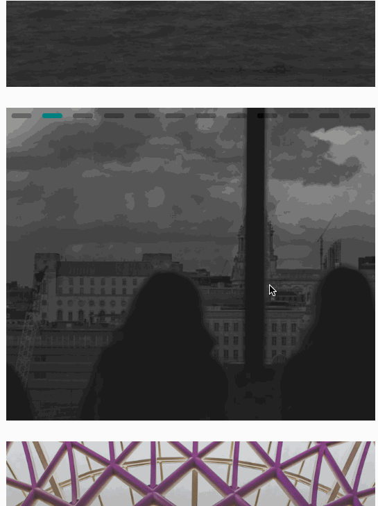

# react-natve-image-tapper

Tinder inspired way to scroll images by tapping the left and right side of the
image.



## Install

`yarn add react-native-image-tapper`

## Demo on expo

https://exp.host/@darryld/tinder-style-image-tapper

## Usage

```javascript
const group0 = [require('./assets/a.jpg')]

const group1 = [
    require('./assets/a.jpg'),
    require('./assets/b.jpg'),
    require('./assets/c.jpg'),
    require('./assets/d.jpg'),
    require('./assets/e.jpg'),
    require('./assets/f.jpg'),
    require('./assets/g.jpg'),
    require('./assets/h.jpg'),
    require('./assets/i.jpg'),
]

const group2 = [
    require('./assets/f.jpg'),
    require('./assets/b.jpg'),
    require('./assets/i.jpg'),
]

const group3 = [
    require('./assets/e.jpg'),
    require('./assets/g.jpg'),
    require('./assets/m.jpg'),
    require('./assets/h.jpg'),
]
;<View>
    <ImageTapper
        images={group0}
        imageWidth={'100%'}
        imageHeight={400}
        resizeMode="cover" //https://facebook.github.io/react-native/docs/image.html#resizemode
    />
    <ImageTapper
        indicatorColor="teal"
        images={group1}
        handleAfterMove={(direction, image) => console.log(direction, image)}
    />
    <ImageTapper images={group2} indicatorLocation="bottom" />
    <ImageTapper images={group3} />
</View>
```

## Todo

* [ ] add tests
* [ ] option to

# License

MIT
